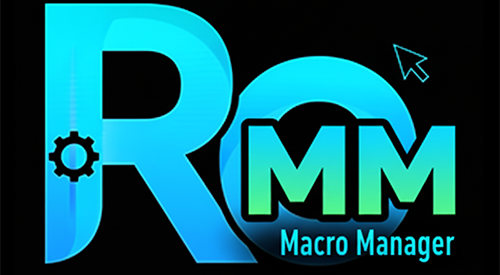

# ROMacroManager

Manages Alt-M (macro) settings for Ragnarok Online. Settings can be saved to profiles, then restored later.

### NOTES:

- This works by reading/writing Windows registry values
- Closing a client OVERWRITES the settings with whatever is currently set in that client
- Clients ONLY load the settings on launch (so restarting a client is required to use new settings)

